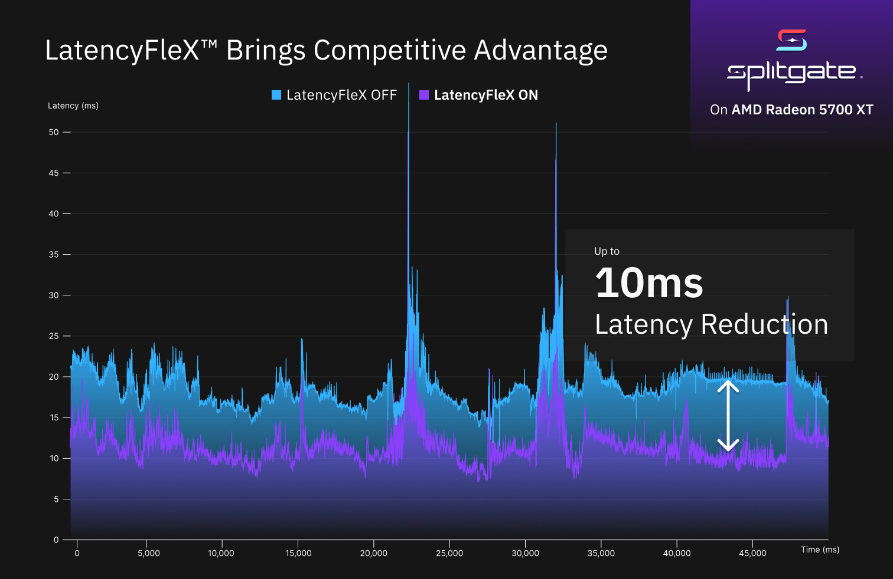

# LatencyFleX (LFX)

Vendor agnostic latency reduction middleware. An alternative to NVIDIA Reflex.



## Why LatencyFleX?

To get an idea why queuing happens in video games and why it causes increased latency, watch this [video](https://www.youtube.com/watch?v=7CKnJ5ujL_Q).

To learn more about LatencyFleX's internals, check out [the blog post](https://ishitatsuyuki.github.io/post/latencyflex/).

## Limitations

- LatencyFleX current does not provide any benefits when VSync is enabled.  
  This is blocked on [presentation timing](https://github.com/KhronosGroup/Vulkan-Docs/pull/1364) support.
- LatencyFleX introduces jitter in frame time as a part of its algorithm, which results in microstutters.  
  Though, most games tend to have a larger frame time fluctuation already, so this is likely unperceivable.

## Known issues

- Minor stutters might happen.

  **Tip:** If you are using AMD GPUs, try modifying the power profile to reduce power management induced stutters: https://gitlab.freedesktop.org/drm/amd/-/issues/1500#note_1228253
- GPU utilization will be lower (around 95% when GPU bound).
- It might take one second or two to adapt to large frame rate increases (e.g. if the game sets a background frame limit).

## Building from source

See [docs/BUILDING.md](./docs/BUILDING.md)

## Usage

For now, LatencyFleX can be used on Linux through one of the following injection method. Game engine integration is planned.

### Running games with LatencyFleX

**Warning:** Be careful when using LatencyFleX with games having anti-cheat:

- Direct hooking (UE4 hook) can trip the game's integrity check and directly get you banned.
- Proton NVAPI integration is relatively safe, but I am not responsible for any bans issued due to LatencyFleX.

Please do it at your own risk.

Tested games:

| Game                     | Support | Method          |
|--------------------------|---------|-----------------|
| Apex Legends [^1]        | ✅       | Proton NVAPI   |
| Titanfall 2 w/ Northstar | ✅       | Proton ([Native](https://r2northstar.gitbook.io/r2northstar-wiki/using-northstar/playing-on-linux))|
| Overwatch [^1]           | ✅       | Proton NVAPI   |
| Splitgate [^3]           | ❌       | N/A            |
| Ghostrunner              | ✅       | Proton NVAPI   |
| God of War               | ✅       | Proton NVAPI   |

[^1]: Uses anti-cheat. Use at your own risk.
[^3]: Game was previously supported with manual UE4 Linux hook. This is no longer possible in an easy way as the game does not ship with symbols now.

Game supported but not in list? File a PR to update the table.

#### Proton NVAPI (for games that already have NVIDIA Reflex integration)

1. [Install](#installation) the Vulkan layer, wine extension and DXVK-NVAPI with LFX support.
2. Put the following in `dxvk.conf` [^2]. If you haven't created one, create it next to the game executable.
   If there are multiple executables, try copying and putting `dxvk.conf` next to every executable.
   ```ini
   dxgi.nvapiHack = False
   dxgi.customVendorId = 10de # If running on non-NVIDIA GPU
   ```

3. Launch with the following environment variables:
   ```shell
   PROTON_ENABLE_NVAPI=1 DXVK_NVAPI_DRIVER_VERSION=49729 DXVK_NVAPI_ALLOW_OTHER_DRIVERS=1 LFX=1 %command%
   ```
4. Don't forget to enable **Reflex Low-Latency** in-game.

Not working? See [troubleshooting guide](./docs/TROUBLESHOOTING.md)

[^2]: A previous version of this document claimed that this is DX11 only. This is not true and it's required for DX12 too
as they use DXVK's DXGI implementation.

#### UE4 Hook

Supported platforms: Linux (see note)

**Note:** for now, the UE4 hook only supports Linux UE4 builds with PIE disabled.

1. [Install](#installation) the Vulkan layer.

2. Obtain an offset to `FEngineLoop::Tick`. If the game ships with debug symbols, the
   offset can be obtained with the command:
   ```shell
   readelf -Ws PortalWars/Binaries/Linux/PortalWars-Linux-Shipping.debug | c++filt | grep FEngineLoop::Tick
   ```
   Find the line corresponding to the actual function (other entries are for types used in the function and unrelated):
   ```
   268: 00000000026698e0  9876 FUNC    LOCAL  HIDDEN    15 FEngineLoop::Tick()
   ```
   Here `26698e0` is the offset we need. We will call it `<OFFSET>` below.
3. Modify the launch command-line as follows.
   ```shell
   LFX=1 LFX_UE4_HOOK=0x<OFFSET> %command%
   ```

#### Unity Mod/Hook

Supported platforms: Proton, Linux

1. [Install](#installation) the Vulkan layer. Also install the Wine extension if the game runs on Wine/Proton.
2. Install [BepInEx Bleeding Edge](https://docs.bepinex.dev/master/articles/user_guide/installation/index.html) to the game directory.
3. Run the game once to generate BepInEx directory structure, config files and startup log.
   Obtain the Unity version from the first line of `BepInEx/LogOutput.log`.
4. Drop `unity/<RUNTIME>-<VERSION>/LatencyFleX.dll` (from [release artifacts](https://github.com/ishitatsuyuki/LatencyFleX/releases))
   into `BepInEx/plugins`. `<RUNTIME>` is `mono` or `il2cpp`. `<VERSION>` is:
   - `2018.1` for any version higher or equal to 2018.1 (This is currently unsupported for IL2CPP)
   - `2019.3` for any version higher or equal to 2019.3
   - Older versions (5.x, 4.x) are unsupported.
6. Use the following launch command-line.
   ```shell
   LFX=1 %command% -force-vulkan # for native
   WINEDLLOVERRIDES="winhttp=n,b" LFX=1 %command% # for Proton
   ```

## Installation

### LatencyFleX Vulkan layer (essential)


You can get releases for Fedora and OpenSUSE from my [Copr](https://copr.fedorainfracloud.org/coprs/kylegospo/LatencyFleX/).

For other distributions, please see the [upstream repository](https://github.com/ishitatsuyuki/LatencyFleX).

### LatencyFleX Wine extensions (required for Proton Reflex integration)

**Note:** The Wine extensions are migrated to a new Wine API in this version. Wine 7.0 or later is recommended, older versions might be unsupported.

1. Copy the following files from [release artifacts](https://github.com/ishitatsuyuki/LatencyFleX/releases) to your Wine installation location.

   For Wine 7.x: change `/usr/lib/wine` to wherever Wine/Proton is installed.
   For Proton and certain distros, you also need to change `lib` to `lib64`. Copy the following files.
   
   ```
   /usr/lib/wine/x86_64-unix/latencyflex_layer.so
   /usr/lib/wine/x86_64-windows/latencyflex_layer.dll
   /usr/lib/wine/x86_64-windows/latencyflex_wine.dll
   ```

   For Wine <= 6.x: copy the files as follows.
   
   ```
   /usr/lib/wine/x86_64-unix/latencyflex_layer.dll.so -> lib/wine/latencyflex_layer.so
   /usr/lib/wine/x86_64-windows/latencyflex_layer.dll -> lib/wine/fakedlls/latencyflex_layer.dll
   /usr/lib/wine/x86_64-windows/latencyflex_wine.dll -> lib/wine/fakedlls/latencyflex_wine.dll
   ```
2. Create symbolic links to `latencyflex_layer.dll` and `latencyflex_wine.dll`, inside `drive_c/windows/system32/` under your prefix.

   (Alternatively, copy these files. The drawback is that you need to copy these files on every LFX update.)

   Proton prefixes can be found under `~/.local/share/Steam/steamapps/compatdata/<appid>/pfx`.

### DXVK-NVAPI with LatencyFleX integration (required for Proton Reflex integration)

Obtain binaries from [GitHub Releases](https://github.com/jp7677/dxvk-nvapi/releases). Minimum version with LatencyFlex integration is 0.5.3.

For Proton, copy `nvapi64.dll` into `dist/lib64/wine/nvapi`.

For other Wine installations, see [DXVK-NVAPI documentation](https://github.com/jp7677/dxvk-nvapi#how-to-use).

### MangoHud with metric support (optional)

Obtain binaries from [GitHub Actions](https://github.com/ishitatsuyuki/MangoHud/actions?query=branch%3Acustom-metrics)
and install it to your system.

Put the following line in `MangoHud.conf` to have real-time latency metrics:

```
graphs=custom_Latency
```
